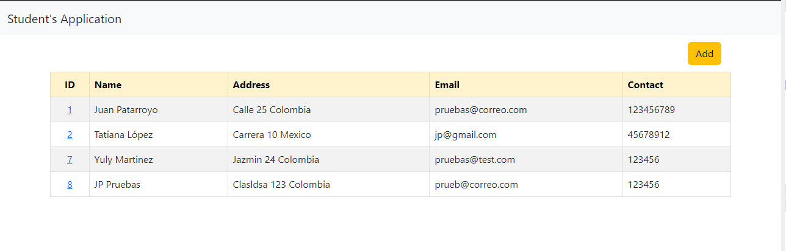
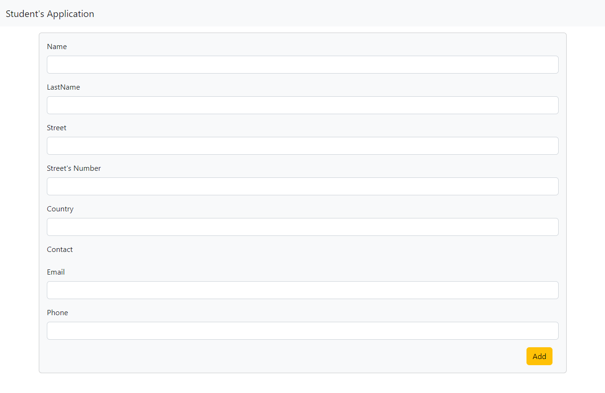
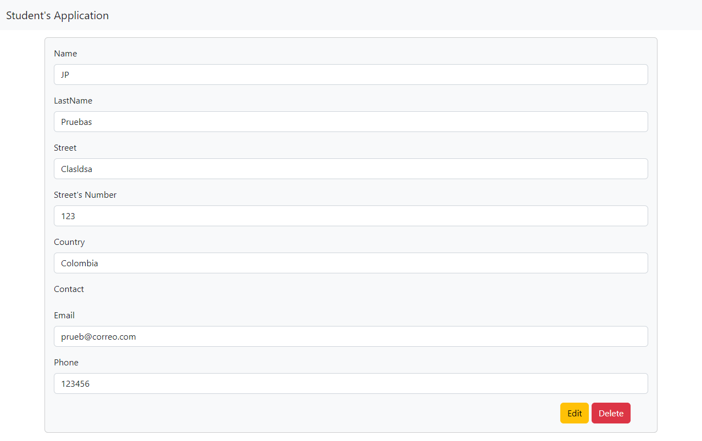

<!-- PROJECT LOGO -->
 

  

  <h3 align="center">Hibernate App Study</h3>

  

    This project contains my study about Hibernate and how to use it
  

<!-- TABLE OF CONTENTS -->

  
Table of Contents

  <ol>
    <li>
      <a href="#about-the-project">About The Project</a>
      <ul>
        <li><a href="#built-with">Built With</a></li>
      </ul>
    </li>
    <li><a href="#getting-started">Getting Started</a></li>
    <li><a href="#contact">Contact</a></li>
    <li><a href="#screenshots">Screenshots</a></li>
  </ol>

<!-- ABOUT THE PROJECT -->
## About The Project

This project is a study about Hibernate, you could find several principles that you can use in your own projects.

You could find:
* CRUD in Hibernate
* Associations
* Hibernate's lifecycle
* Cascade persistence
* Entity Service with generic Class
* Implementation with bootstrap.

### Built With

Technologies and languages that I use to create the project:

* [![Java][Java.web]][Java-url]
* [![Hibernate][Hibernate.sql]][Hibernate-url]
* [![Bootstrap][Bootstrap.com]][Bootstrap-url]

<!-- GETTING STARTED -->
## Getting Started

You need to create a database called "sga", in this case I use this db with the credentials:
* User: root
* Password: admin
But you could change in the persistence.xml, setting your connection.

The database should have a tables called:
* Address:
  * id 
  * street
  * number_street 
  * country
* Contact
  * id_contact 
  * phone 
  * email
* Course
  * id_course
  * name
  * value
* Student
  * id_student
  * id_address
  * id_contact
  * name
  * last_name
* Asignation
  * id_asignation
  * id_student
  * id_course
  * schedule
There are the classes used in the project.

<!-- CONTACT -->
## Contact

It'll a pleasure to connect with you in LinkedIn. - Juanes! - [Juan Esteban Patarroyo](https://www.linkedin.com/in/juan-esteban-patarroyo-61a566186/)

<!-- Screenshots -->
## Screenshots

<!-- MARKDOWN LINKS & IMAGES -->
[Java.web]: https://img.shields.io/badge/Java-20232A?style=for-the-badge&logo=java&logoColor=61DAFB
[Java-url]: https://www.java.com/es/
[Hibernate.sql]: https://img.shields.io/badge/Hibernate-365CF9?style=for-the-badge&logo=hibernate&logoColor=61DAFB
[Hibernate-url]: https://hibernate.org
[Bootstrap.com]: https://img.shields.io/badge/Bootstrap-563D7C?style=for-the-badge&logo=bootstrap&logoColor=white
[Bootstrap-url]: https://getbootstrap.com
